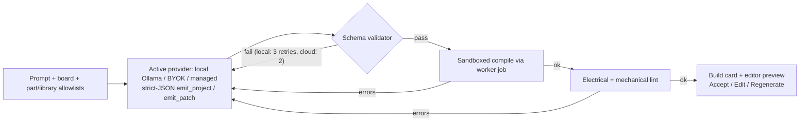

# Audrino — Product & Engineering Spec

**Version:** v2.3 — Engineering spec (hardened per review, 2026-09-22)
**Status:** Architecture frozen for M0 — v2.3 folds in the review's "add now" items; further findings come from implementation, not more spec rounds
**Supersedes:** v2.2, v2.1, v2.0, v1.0

**Locked decisions:**
- Real firmware execution (not fake animations); Uno in-browser, ESP32 via server QEMU
- **AI is local-first:** Ollama on the user's machine is the default (direct browser→localhost, warned slow) · BYOK cloud keys supported (direct) · managed proxy comes later with accounts. All paths share validate → compile → lint → repair gates
- Multi-board: Uno + ESP32 (phased: Uno first, ESP32 later)
- **Vercel-first deployment:** Vite app + TS Functions for application backend (API/AI-orchestration); **separate Docker workers as the compute backend** (all compile + all sim execution). Hard boundary, job protocol between them
- **2D canvas for v1, data model 3D-ready** — but M0 must not be contaminated with unnecessary 3D abstractions
- **Accounts + protection:** Supabase Auth (email/OAuth), verified-email gates for costly features, RLS everywhere, quotas + abuse controls (§12.1–12.2)

**v2.2 → v2.3 changelog (hardening only, no architecture changes):**
1. Jobs: formal state machine + transition ownership + atomic claiming + exact `build_hash` + service auth + scoped sim tokens (§4.5)
2. DSL: formal invariants + structured `PinRef` with string serialization (§5.4)
3. Sim: versioned `SimEvent` envelope — Uno and QEMU share one consumer API (§7.3) + golden-trace convention (§7.1)
4. AI: per-request patch budgets (§9.2) + internal outcome records, no fake confidence % (§9.3) + runtime model registry + session-only BYOK default (§9.0)
5. Lint: exact three-state Run UX — Error / Warning / Impossible (§7.4)
6. Data: `parent_revision_id` ancestry (§13) + artifact lifecycle (§8)
7. NEW §12.1–12.2: user accounts (signup/login/OAuth/verification/deletion) + platform protection (layered defenses, quotas, abuse, supply chain)
8. Terminology normalized: `POST /api/...` in all flows; the compute backend is always "workers"
9. M2 keeps servo+arm (robotics is defining for Audrino) with an explicit M2a/M2b split trigger if it overruns
10. M3 evals upgraded to deterministic `tests/ai/*.yaml` fixtures with simulation assertions

**v2.3 patch (2026-09-22 — hardening per review, deliberately not v2.4):**
async compile API (202 + poll + cancel) · `revision_id` in jobs/sessions · sequenced,
discriminated `SimEvent` union · transactional AI patches · undo/redo + copy/paste in M0 ·
`project_forks` removed · sim-model versions · `render_fps` vs emulator clock · library
`sim_support` · provider `directBrowser` capability · derived project manifest ·
diagnosis categories · `CodeEditor` interface · progressive Ollama setup UX

---

## 1. What we're building

**One sentence:** Describe a circuit → place/wire components → write real Arduino code → compile real firmware → execute it in an emulator → watch the parts respond.

**Uno flow (in-browser):**

```text
Arduino C++ → arduino-cli → firmware.hex → avr8js → ATmega328P emulation
  → GPIO / PWM / ADC / UART → LED / button / servo / LCD / sensors → interactive canvas
```

**ESP32 flow (server-assisted, same UX):**

```text
Arduino C++ → arduino-cli → firmware.bin → QEMU (server) → WebSocket → browser canvas
```

**Product shape:** Figma-like circuit editor + VS Code-like Arduino IDE + real firmware execution against deterministic behavioral peripheral models + AI agent that produces *runnable projects*, not just code snippets.

**Differentiator (specific, testable):** AI-native project generation that produces a complete runnable circuit — parts, wiring, firmware, explanation, and BOM — from a natural-language request.

**Correctness bar:** every part ships testable acceptance criteria (see §7.1), e.g. *LED: digital HIGH → visibly on; LOW → off; PWM 25% → brightness approximately proportional.* No vague "emulator-grade" aspirations as requirements.

### Non-goals for v1
- No 3D renderer (but the scene model must not block it — §10)
- No SPICE-grade analog solving (behavioral part models only)
- No PCB layout / manufacturing export
- No real-hardware flashing (WebSerial is a v2 stretch goal)
- No rigid-body physics (mechanical motion is **kinematic** — motors drive joints; gravity/collision deferred)
- No multiplayer cursors (single-player + share/fork)

---

## 2. Competitive landscape

| Tool | Strength | Gap Audrino exploits |
|---|---|---|
| Tinkercad Circuits | Easiest classroom UX | Uno-only, no ESP32, no AI generation, closed |
| Wokwi | Real emulation, ESP32, sharing culture | ESP32 core closed-source, AI is bolt-on |
| Velxio (AGPLv3) | Multi-board, browser AVR + server QEMU | Dev-tool UX, no AI-native project spawning; license constrains forks |
| Tinkered.ai | AI + 3D positioning | Closed; Audrino competes on open + community + templates |

**Dependency/licensing policy (hard rule):**
- ✅ `avr8js` (MIT) — Uno CPU emulation, via npm
- ✅ `wokwi-elements` (MIT) — candidate for part visuals, behind our own `PartVisual` interface so we can swap assets later; note it provides **visuals only, no sim behavior**
- 🔍 Velxio — **reference architecture only** (AGPLv3 + commercial dual-license). Read it, learn the browser/QEMU split from it, never copy code or fork
- ✅ Our own circuit engine, project DSL, AI system, UX — this is the actual product/IP

---

## 3. Product definition

### Personas
1. **Beginner:** "I own no hardware. Teach me and let me tinker free."
2. **Builder:** "Prototype my sensor/mechanism fast, then buy parts."
3. **Educator:** "Give my class shareable assignments with working starters."

### Must-have (v1)
- Parts palette → canvas drag-drop, rotate, delete, labels
- Net-aware wiring: click-to-wire, net highlighting, junction dots, orthogonal cleanup
- Boards: Uno + ESP32 DevKit. Parts: breadboard, LED, RGB LED, resistor, pushbutton, potentiometer, buzzer, SG90 servo, LCD 16×2 (I2C), DHT22, HC-SR04
- **Mechanical palette:** box, cylinder, wheel, arm-link, custom polygon plate — attachable via welds/joints (§10)
- Code editor (Arduino C++) with inline errors, examples, formatting; library picker from approved registry
- Run / Stop / Reset, speed control, bidirectional serial monitor
- Live interaction: press button, twist pot, move distance slider, watch servo-driven arms move
- Pin probes (digital/analog/PWM readout), net inspector, **component inspect panel**
- AI panel: Explain / Assist / **Spawn ("Build this for me")** / Diagnose / Repair — local Ollama default, BYOK optional
- Accounts: signup/login (email + OAuth), profiles, verified-email gates for costly features
- Save/fork/share, templates gallery, **revision history with restore**, BOM + wiring checklist

### v2+
- Blocks editor → Arduino C++ transpiler; OLED, NeoPixel, keypad, relay, DC motor + H-bridge, PIR, soil sensor
- Logic analyzer / oscilloscope; WiFi/MQTT virtual broker; MicroPython mode
- 3D renderer on the same scene model; rigid-body physics; WebSerial flash; classrooms

---

## 4. Stack + deployment (Vercel-first)

### 4.1 Deployment

**Core distinction: Vercel Functions are the application backend. Docker workers are the compute backend. These are not the same thing.**

```text
                    Vercel (primary platform)
                       │
        ┌──────────────┼──────────────┐
        │              │              │
      React           API            AI orchestration
   Vite + TS      TS Functions    streamed HTTP (SSE)
        │              │
        └──────────────┤
                       │
                    Supabase
                 PostgreSQL/Auth
                       │
                 Workers — compute backend (Fly.io/Render, Docker)
                       │
              ┌────────┴────────┐
              │                 │
         arduino-cli          QEMU
      (ALL compilation)   (ESP32 sim)
              │                 │
              └── sandboxed ────┘ (§8)
```

**Hard boundary — what runs where:**

| Vercel (application backend) | Workers (compute backend) |
|---|---|
| Auth integration, projects CRUD, gallery, sharing | `arduino-cli` + GCC/toolchains (even fast Uno compiles) |
| AI orchestration endpoints + streamed HTTP responses | QEMU fleet (ESP32 execution) |
| Validation, schema checks, library-allowlist checks | Long-running sim sessions + WS event streams |
| Quota/auth checks, hash-cache lookup | Python/shell/simulator tooling as needed |
| Job creation + status reads (orchestration) | Job execution (untrusted/native processes) |
| DB access | Nothing else touches user firmware |

**Why the boundary is absolute:** Vercel Functions have resource and execution constraints, and WebSocket support is explicitly **public beta** (Vercel Functions provide native streaming and, since June 2026, public-beta WebSocket support). Vercel's own docs have carried conflicting wording around WebSockets historically — one more reason the ESP32 event stream goes **direct browser→worker** and never depends on Vercel WebSockets. More fundamentally, **QEMU and native toolchains are simply the wrong workload for the Function layer** — and routing even Uno compiles through workers gives one consistent, sandboxable execution architecture from day one, so adding ESP32 / third-party libs / user uploads later requires no redesign.

**Request paths:**

```text
Browser ──HTTPS/SSE──▶ Vercel Functions ──▶ Supabase (projects/auth/db)
Browser ──HTTPS──────▶ POST /api/compile ──▶ 200 (cache hit) ··· or ··· 202 {jobId} → poll (§12)
                                                          └─miss──▶ job row ──▶ workers ──▶ hex/bin + errors
Browser ──WS (direct)─▶ Sim worker (short-lived session token minted by Vercel)
Browser ──direct──────▶ localhost:11434 (local Ollama) ··· or ··· cloud LLM APIs (BYOK)
Browser ──SSE────────▶ Vercel /ai/* (managed tier only, M4+)
```

Direct browser→worker sim WebSocket (not relayed through Vercel) keeps latency low and Function spend bounded.

### 4.2 Why not Next.js
The product is a desktop-like interactive app (canvas + sim + Monaco + editors), not a content site. SSR buys little and complicates the sim loop. **React + Vite + TS on Vercel** (a natively supported template, `api/` directory for Functions) is the right call.

### 4.3 Frontend choices
| Concern | Choice | Why |
|---|---|---|
| Framework | React + Vite + TypeScript | Velocity, hiring, Vercel-native |
| Styling | Tailwind | Fast schematic/mechanical UI |
| Client state | Zustand (editor doc, selection, tool) | Sim tick stays outside React renders |
| Server state | TanStack Query | Projects, gallery, jobs, AI history |
| Code editor | `CodeEditor` interface → `MonacoAdapter` (M0) | App depends on the interface only; Monaco is swappable, same principle as PartVisual / IRenderer / AIProvider |
| Circuit canvas | **Custom SVG interaction layer over net model** | React Flow *can* do free placement and arbitrary connections — but its generic node/edge abstraction is not a natural fit for pin-level electrical nets, junctions, breadboards, orthogonal wire segments, and circuit-specific hit testing. Our canonical model is electrical, so the renderer is custom |
| Part visuals | wokwi-elements **or** own SVG, behind `PartVisual` interface | Start fast, stay swappable for 3D later |
| AI streaming | HTTP/SSE (managed) · direct fetch (local/BYOK) | WS only where truly bidirectional; Vercel WS is beta |
| Sim transport | WS event batches direct to workers (§7.3) | No 60Hz full snapshots, no Vercel relay |

### 4.4 Backend language decision
> **API + orchestration: TypeScript on Vercel Functions** (single language across the app team, native streaming).
> **Workers: Dockerized services, language per worker** — TS by default (shares schema/validator), Python explicitly allowed wherever toolchain wrangling is easier. "One language" is a convenience, not a religion.

The Vercel side only ever sees `{ jobId, status }` — worker internals are an implementation detail.

### 4.5 Vercel ⇄ workers job protocol
Vercel Functions never manage subprocess lifecycles. They write **job rows** (Postgres, source of truth), kick the workers over HTTPS, and read status back. Workers claim, execute sandboxed, and update the row (+ optional callback).

```jsonc
// Vercel → workers (kick; full payload also in the job row)
{ "jobId": "abc123", "type": "compile", "board": "arduino:avr:uno",
  "projectRevision": "rev_42" }
// or
{ "jobId": "xyz987", "type": "simulation-start", "board": "esp32",
  "firmwareArtifact": "sha256:…", "sessionToken": "…" }

// Workers → Vercel (row updates / callback)
{ "jobId": "abc123", "status": "queued|claimed|running|completed|failed|cancelled|timed_out",
  "artifactRef": "…", "errors": [ … ] }
```

**Job state machine:**

```text
queued → claimed → running → completed
                        ├→ failed
                        ├→ cancelled
                        └→ timed_out
```

Job rows carry `attempt`, `worker_id`, `started_at`, `finished_at`, `error_code`.
**Transition ownership:** Vercel creates (`queued`) and may mark `cancelled`; workers move
`queued → claimed → running → terminal` — and a worker may only transition jobs **it** claimed
(enforced by `WHERE worker_id = $worker`), never unrelated jobs. Terminal states are final.
Stale `claimed` rows (no heartbeat within N minutes) are reaped to `queued` with `attempt + 1`,
so crashed workers can't wedge the queue.

**Atomic claiming (multi-worker safe):**

```sql
UPDATE compile_jobs
SET status = 'claimed', worker_id = $worker, started_at = now()
WHERE id = $id AND status = 'queued'
RETURNING *;
```

Only one worker wins the row. Same pattern for simulation jobs.

**Build hash (exact cache key):**

```text
build_hash = SHA256(FQBN + core version + library {name@version…}
                    + compiler flags + all source files)
```

Never the `.ino` alone — same code + different library version must not collide.
Artifacts are content-addressed: `artifactRef = sha256:<hash of artifact bytes>`.
Cache scope: the cache is immutable and content-addressed — a successful `build_hash`
always resolves to the same artifact bytes. Two identities: **build identity**
(`build_hash` = "what produced it?") and **artifact identity** (`artifactRef` =
"what bytes exist?"), so toolchain upgrades invalidate builds without confusion.

**Authentication (both directions):**
- **Vercel → workers:** private HTTPS + service credential (rotatable bearer from a secret
  manager; mTLS where the host supports it). Workers reject unknown callers.
- **Browser → worker WS:** short-lived simulation token minted by Vercel and verified by
  the worker: `{ session_id, project_id, revision_id, user_id, operation: "sim-stream",
  expires_at (≤15 min), max_duration }`. Tokens are single-session scoped — a token for
  session A cannot open, steal, or snoop session B, nor launch new simulations.

**The worker interface is stateless and infrastructure-agnostic at the API boundary:**

```text
POST /jobs                 create compile/sim job
GET  /jobs/:id             status + result refs
POST /simulations/:id/stop stop a running session
WS   /simulations/:id      event stream (token-authenticated)
```

Internally workers may be any language on any host with any scheduler. Vercel code must never know "this is a Python worker" / "this is Fly.io" / "this is worker-7" — only this HTTP contract.

**Queue:** Postgres job rows to start. Vercel Queues (public beta, durable delivery/retry) evaluated and **deferred** — the Postgres queue is simpler at our scale; swap later without touching DSL or sim architecture. Same for Redis: only when throughput demands it.

---

## 5. Project DSL v2 (canonical Audrino format)

**Principle:** one versioned JSON document drives canvas, sim, AI, lint, save/share, BOM, and wiring docs. Wokwi `diagram.json` is supported via **importer/exporter**, never as the canonical model.

### 5.1 Nets, not point-to-point wires
Real circuits are **nets** (one electrical node, many pins) with **visual wire segments** drawn on top. Breadboards, junctions, and buses fall out naturally.

```jsonc
{
  "meta": { "name": "Traffic light", "dslVersion": 2, "boardId": "board1" },
  "boards": [{ "id": "board1", "type": "arduino-uno", "transform": { "x": 40, "y": 40 } }],
  "components": [
    { "id": "ledR", "type": "led", "props": { "color": "red" },
      "transform": { "x": 220, "y": 80, "rotation_deg": 0 } }
  ],
  // Logical electrical connectivity
  "nets": [
    { "id": "net-d10", "pins": ["board1:D10", "r1:1"] },
    { "id": "net-gnd", "pins": ["board1:GND", "ledR:K", "btn1:2"] }
  ],
  // Visual routing only; every segment belongs to exactly one net
  "wires": [
    { "id": "w1", "net": "net-d10", "points": [[150, 90], [150, 130], [205, 130]] }
  ],
  "mechanics": {
    "bodies": [
      { "id": "arm1", "shape": "box", "size_mm": { "w": 90, "h": 12 },
        "material": { "color": "#8ab4ff" },
        "transform": { "x": 0, "y": 0, "z": 0 } }
    ],
    "joints": [
      { "id": "j1", "type": "revolute", "parent": "servo1:horn",
        "child": "arm1", "axis": "z", "limits": { "min_deg": -90, "max_deg": 90 },
        "driver": { "kind": "servo", "ref": "servo1" } }
    ]
  },
  "code": {
    "main": "sketch.ino",
    "files": { "sketch.ino": "void setup() {...}\nvoid loop() {...}\n" }
  },
  "build": {
    "fqbn": "arduino:avr:uno",
    "core": "arduino:avr@1.8.6",
    "libraries": [{ "name": "Servo", "version": "^1.1.0" }]
  },
  "sim": { "render_fps": 60, "defaults": { "pot1": 512, "hcsr04_1_mm": 300 } },
  "ai": { "prompt": "traffic light with pedestrian button",
          "explanation": "...", "bom": ["..."], "wiringSteps": ["..."] }
}
```

**Top-level sections:** `meta · boards · components · nets · wires · mechanics · code · build · sim · ai`.

**3D-readiness (no 3D renderer in v1):** every placed thing carries a `transform` with optional `z` / full rotation; the renderer consumes a **scene graph interface**, so a three.js renderer can replace/augment the SVG one without touching the DSL:

```text
Project DSL → Scene graph (nodes, transforms, attachments) → IRRenderer2D (SVG, v1)
                                                                  ↳ IRenderer3D (later)
```

### 5.2 Schema governance
- JSON Schema + TS types + validator in `packages/schema`, versioned (`dslVersion`), with migration helpers.
- Validator runs **client-side** (instant) and **server-side** (managed-AI gate + API writes).
- Golden fixtures: every example/template must validate in CI.

### 5.3 Units convention (locked before part definitions multiply)
- Physical quantities use **suffix style**: `distance_mm`, `resistance_ohms`, `angle_deg`, `time_ms`, `voltage_mV`, `current_mA`, `rpm`… Never bare numbers for physical quantities. AI prompts, fixtures, and validators follow the same convention.
- **Canvas/transform coordinates are millimeters** (`x`, `y`, `z` in mm; `rotation_deg` in degrees). This keeps 2D layout and future 3D extrusion on one unit system.
- Mechanical sizes: `size_mm: { w, h }` (extrusion `depth_mm` if 3D needs it later). Anchor offsets in mm.

### 5.4 DSL invariants (formal — the validator, linter, and AI gate enforce all of these)
1. Every pin belongs to **zero or one** net.
2. A wire segment belongs to **exactly one** net.
3. A net cannot contain the same pin twice.
4. Component, board, body, joint, net, and wire IDs are **globally unique** within a project.
5. Every referenced pin must exist on its component's `PartDefinition`.
6. Every net pin's component/board reference must resolve to a declared component or board.
7. A mechanical joint must not create an attachment cycle.
8. Every joint driver must reference an existing part capable of driving it.
9. Every `#include` must resolve to the approved library registry (§6.1).
10. All physical quantities use §5.3 suffix keys — bare quantities fail validation.

Pin references serialize as `"componentId:pinId"` strings (e.g. `"board1:D10"`), but all
internal APIs parse them into `PinRef { componentId, pinId }` — no string-splitting in
business logic, no breakage if IDs ever contain `:`.

### 5.5 Derived project manifest (lightweight, for search/gallery/AI/cache)
`project_json` stays canonical, but servers and gallery UIs read a derived manifest instead
of loading full projects:
```json
{ "project_id": "…", "revision_id": "…", "boards": ["arduino-uno"],
  "component_types": ["led", "resistor", "button"], "libraries": ["Servo"],
  "build_hash": "…", "dsl_version": 2 }
```
Regenerated on every revision; used for search, filters, recommendations, AI context, cache lookup.

---

## 6. Component specification (the AI's ground truth)

Every part — electronic or mechanical anchor — is declared, not hardcoded. This struct (not prompt prose) is what the AI reasons over.

```ts
interface PartDefinition {
  id: string;            // "led", "sg90-servo", "arduino-uno"
  version: string;
  kind: "board" | "part" | "mechanical-anchor";
  visual: { width_mm: number; height_mm: number; asset: string; anchors?: AnchorDef[] };
  pins: PinDefinition[];
  properties: PropertyDefinition[];   // color, resistance_ohms, i2c_address… (§5.3 units)
  electrical: ElectricalModel;        // pullups? series R? max current? level?
  simulation: SimulationModel;        // { model, version, params } — versioned; golden traces record it
  acceptance: AcceptanceCriterion[];  // testable §7.1 criteria, e.g. LED PWM behavior
}

interface PinDefinition {
  id: string;                        // "D10", "VCC", "SDA"
  label: string;
  direction: "in" | "out" | "bidir" | "power" | "ground";
  electrical: { nominal_voltage_V?: number; max_voltage_V: number; max_current_mA?: number };
  capabilities: Array<"digital" | "analog" | "pwm" | "interrupt" | "i2c" | "spi" | "uart" | "servo-pulse">;
  protocol?: { bus?: "i2c" | "spi" | "uart" | "onewire"; role?: "sda" | "scl" | string };
}

interface AnchorDef {                  // mechanical attachment points (offsets in mm)
  id: string;                        // "horn", "axle", "mount-m3"
  offset: { x: number; y: number; z?: number };
  jointTypes: Array<"fixed" | "revolute" | "prismatic">;
}
```

interface SimulationModel {
  model: string;     // "dht22", "sg90", "hd44780-i2c"…
  version: string;   // "1.2" — a project simulated last month must reproduce bit-identically
  params?: Record<string, number | string | boolean>;
}

Boards get full pin tables (Uno: 5V logic; ESP32: 3.3V logic, strapping-pin warnings, ADC quirks) in `docs/boards/*.yaml`, code-generated into TS + the AI's context pack.

**Visual layering (M0):** `PartDefinition → PartVisual → (wokwi-elements | own SVG)`. Wokwi buys M0 speed but must never become the internal component model; `PartVisual` gains a glTF branch in v2.

**Mechanical placement note (M2, not urgent):** anchors sit under `visual.anchors` for M0/M1
convenience, but a servo horn is a mechanical property, not a visual one — expect a migration
to top-level `mechanical?: { anchors: AnchorDef[] }` during M2. Nothing outside
`packages/parts` may depend on the interim location.

### 6.1 Approved library registry
AI may only `#include` libraries from `packages/libraries/registry.yaml`. Each entry carries
`{ name, version, headers, fqbn, dependencies, source, license, install_size_bytes, sim_support }`,
where `sim_support: { uno: bool, esp32: bool }` tells the AI "compiles but not yet simulated"
*before* it generates — never discovered post-compile. Unknown includes fail validation with
"did you mean…?" suggestions. Registry PRs are the path to add libraries.

---

## 7. Simulation architecture

### 7.1 Uno path (browser, Web Worker)
```text
sketch.ino ──(worker compile job, cached)──▶ firmware.hex ──▶ avr8js CPU @16MHz (Worker)
  ──▶ GPIO/timers/ADC/UART/EEPROM ──▶ peripheral models ──▶ event bus ──▶ SVG renderer @60fps
```
- avr8js provides CPU, ports, Timer0/1/2 (millis/delay/PWM), ADC, interrupts, EEPROM, UART.
- We write **behavioral models**: LED (PWM-duty brightness), button (debounce/pullup), DHT22 (1-wire timing), HC-SR04 (echo width from distance), SG90 (pulse→angle→**joint driver**), LCD-I2C (HD44780 over virtual I2C)…
- Deterministic tick; pause/step; sim state snapshot for Diagnose.
- Clock separation: the emulator advances on CPU time (16 MHz AVR); `render_fps` (default 60)
  only paces event batching + rendering. `delayMicroseconds`, PWM, UART, interrupts, and
  sensor timing live in emulator time, never in frame time.
- **Acceptance convention:** each model ships criteria in its `PartDefinition.acceptance`, exercised by golden tests. Example (LED): `D:HIGH→on · D:LOW→off · PWM 25%→brightness ≈ proportional · reverse polarity→off`. A part is "done" when its criteria pass.
- **Golden simulation traces:** determinism tests assert `same firmware + same project + same initial state → same event sequence` (e.g. `GPIO13 HIGH @1002ms` on every run). Stored traces make AI-generated-project debugging tractable.

### 7.2 ESP32 path (sandboxed QEMU workers)
```text
sketch.ino ──(worker compile job)──▶ firmware.bin ──▶ isolated QEMU process ──▶ virtual GPIO/UART
  ──▶ WS event batches (direct to browser) ──▶ same canvas, "cloud" badge
```
- Session lifecycle: Vercel mints token → browser opens WS to worker → idle timeout ~10 min → queue with visible position.
- Degraded modes: queue position shown honestly; offer "convert to Uno" or visual preview when busy.

### 7.3 Event batches, not snapshots
No full-state streaming. Workers/emulators emit **typed events**, batched per frame:

```text
GPIO_CHANGED / PWM_CHANGED / ADC_CHANGED / UART_TX / UART_RX
SERVO_ANGLE / LCD_UPDATE / SENSOR_SAMPLE / NET_SHORT_FAULT / JOINT_MOVED
```

```text
frame 1842 [t=3.071s]
 ├─ GPIO board1.D10 = HIGH
 ├─ PWM board1.D9 duty = 74%
 ├─ SERVO servo1.angle = 63° → JOINT j1 = 63° → BODY arm1.transform = …
 └─ UART TX "T=28.3 H=61"
```

The event envelope is **independently versioned** in `packages/sim-core` (bump only on breaking change).
`sequence` is a per-session monotonic counter — a gap (…120, 121, 123…) proves event loss and
enables deterministic replay. Payloads are a **discriminated union** on `type`:

```ts
type SimEvent =
  | { version: 1; sequence: number; timestamp_ms: number; source: string;
      type: "GPIO_CHANGED"; payload: { pin: PinRef; value: 0 | 1 } }
  | { version: 1; sequence: number; timestamp_ms: number; source: string;
      type: "PWM_CHANGED"; payload: { pin: PinRef; duty_percent: number } }
  | { version: 1; sequence: number; timestamp_ms: number; source: string;
      type: "SERVO_ANGLE"; payload: { component: string; angle_deg: number } };
  // …one member per event type (ADC_CHANGED, UART_TX/RX, LCD_UPDATE, JOINT_MOVED…)

if (event.type === "GPIO_CHANGED") {
  event.payload.value; // ✓ automatically typed 0 | 1
}
```

```text
avr8js ─▶ SimEvent[] ─┐
                      ├─▶ same consumer API (the UI never knows the producer)
QEMU   ─▶ SimEvent[] ─┘
```

Client applies events to local scene state; renderer diffs. Same bus drives Uno (Worker→main) and ESP32 (WS→main).

### 7.4 Electrical lint (metadata-driven, board-specific)
Rules read `PartDefinition.electrical` + board constraints — not generic guesses:
- Dead shorts (power↔ground same net), output↔output contention, overvoltage (5V→ESP32 GPIO), overcurrent hints
- LED needs resistor **unless** `electrical.seriesResistor === true` (LED modules) or current-limited driver pin
- I2C pullups required **unless** a part on the net declares `pullups: {SDA/SCL: true}`
- Floating input warnings, unconnected required pins, ESP32 strapping-pin warnings

**Severity semantics (locked):**
- **Error** = simulation cannot be trusted or cannot start. Blocks Run, with **[Run anyway]** override — except truly impossible states (no board, firmware missing/uncompilable), which are unoverrideable.
- **Warning** = sim runs, but the real-world circuit may misbehave or be unsafe. **[Run]** proceeds; warning stays visible.
- **Info** = improvement/recommendation. **[Run]** proceeds.

Never make every hardware mistake block Run — beginners must be able to experiment, with consequences clearly labeled.

**Run-button UX (exact):**
- `ERROR` → banner "Circuit cannot reliably simulate" + **[Fix] [Run anyway]**
- `WARNING` → banner "This may damage a real component" + **[Run]**
- Impossible (no board / no firmware) → no Run button at all → **[Add a board]**

---

## 8. Execution Security Architecture (P0 — mandatory before cloud sim)

We compile and execute **untrusted user + AI-generated firmware**. This is not a later optimization.

```text
User/AI code
  ▼
Vercel API: auth, quota, size limits, library-allowlist check, hash cache
  ▼
Job row (Postgres) + HTTPS kick to workers
  ▼
Isolated worker (compile or sim), per job:
 ├── non-root user, read-only root FS, ephemeral scratch volume
 ├── NO outbound network (except allowlisted toolchain mirror, if any)
 ├── CPU / RAM / process / fd limits (cgroups)
 ├── wall-clock timeout (compile ~120s, sim session ~10min idle)
 ├── seccomp / container isolation; QEMU per-session process, killed on disconnect
 └── result only (hex/bin, errors, event stream) returns upstream
  ▼
Result → cache → browser
```

Rules:
- **Nothing user-supplied executes in Vercel Functions** — they orchestrate only. This includes fast Uno compiles.
- QEMU processes are per-session, supervised, and reaped; WS relay cannot reach the host.
- Compile workers can't exfiltrate (no net) or persist (ephemeral FS); firmware artifacts content-addressed.
- Rate limits + quotas per user; abuse flags on repeated timeout bombs / escape attempts.
- Security review gate before M5 (ESP32) ships to public.

**Artifact lifecycle:** `pending → created → referenced-by-session → expired → garbage-collected`.
Metadata per artifact: `{ hash, board, core_version, size_bytes, created_at, expires_at }`.
Unreferenced artifacts expire after 24h; session-referenced ones die with the session (+ short grace).

---

## 9. AI architecture

### 9.0 Provider model: local-first (Ollama default + BYOK + managed later)

The free tier must cost us **$0 in AI spend**. Therefore the default provider runs on the **user's** machine, not ours:

| Tier | Provider | Transport | Auth | When |
|---|---|---|---|---|
| **Default** | Local Ollama (default `http://localhost:11434`, user-configurable for remote hosts) | Browser → Ollama direct (`/api/chat`, structured JSON for spawn/patch) | None (user's own machine) | M3 |
| **Upgrade** | BYOK cloud: `openai-compatible` (covers OpenAI + any OpenAI-style endpoint), `anthropic`, `gemini` (+ `ollama-cloud` later) | Browser → provider direct | User-pasted key: **session-memory-only by default**; persistence only behind an explicit `□ Remember this key on this device` checkbox. **Never sent to Audrino servers** in direct mode | M3 |
| **Later** | Managed (our keys, quotas, login wall) | Browser → Vercel proxy (SSE) | Supabase session | M4+ with accounts |

**Default local model: `qwen2.5-coder:7b` — M3 evaluation candidate, not a permanent dependency.** Target systems with ≥8 GB RAM; recommend ≥16 GB for a comfortable experience (the 7B Q4 weight file alone is ~4.7 GB on disk, before KV cache, context, Ollama, browser, editor, and OS overhead). 32K context window comfortably fits our ~12K-in context pack. The model name appears exactly once in code:

```ts
// packages/ai-orchestrator/src/providers/ollama.ts
export const DEFAULT_LOCAL_MODEL = "qwen2.5-coder:7b"; // eval candidate; switch freely
```

The app holds a **runtime model registry** (`availableModels()` from Ollama `/api/tags` plus
configured cloud models) with a `[Change]` picker in the AI panel. Nothing outside the provider
layer may branch on model identity — only on `capabilities()`.

**Providers expose capability profiles** so the orchestrator never assumes uniform powers:

```ts
interface AIProvider {
  id: "ollama" | "openai" | "anthropic" | "gemini" | "managed" | "mock";
  availableModels(): Promise<ModelInfo[]>;
  selectedModel(): ModelInfo;
  capabilities(): {
    structuredOutput: boolean;  // JSON-schema-constrained output
    toolCalling: boolean;       // native function/tool calling
    vision: boolean;
    contextTokens: number;
    directBrowser: boolean;     // false → provider must use server-proxy transport
  };
  chat(req: ChatRequest): AsyncIterable<string>;
  structured<T>(req: ChatRequest, schema: object): Promise<T>;
}

// Expected M3 profiles (verified during evals, not assumed):
// ollama/qwen2.5-coder:7b → { structuredOutput: true, toolCalling: false, vision: false, contextTokens: 32768, directBrowser: true }
// cloud models          → { structuredOutput: true, toolCalling: true,  vision: varies,  contextTokens: varies,  directBrowser: varies }
// NOTE: "browser-direct" is per-provider, never a universal assumption. A provider with
// directBrowser:false is served via the managed proxy transport (M4+) — no core changes needed.
```

Ollama's API supports structured-output schemas, so the JSON-first strategy works without native tool calling — local limitations stay **architectural** (capability flags + code paths), never prompt hacks.

**Ollama connection/setup is an explicit UX subsystem**, not a bare fetch. The local API needs no auth, but browser origins beyond localhost/127.0.0.1 require `OLLAMA_ORIGINS` on the user's Ollama — so a deployed `https://audrino.vercel.app` must gracefully distinguish:

```text
Local AI setup
 ● Ollama detected · qwen2.5-coder:7b installed · reachable   [Use Local AI]
 ○ Ollama offline          → Install Ollama → start it → Retry
 ○ Model missing           → [Copy: ollama pull qwen2.5-coder:7b] → Retry
 ○ Browser blocked (CORS)  → set OLLAMA_ORIGINS=https://audrino.vercel.app → restart → Retry
```

First-run setup card + connection dot + persistent local-mode banner: *"Local AI: free & private — slower and less accurate than cloud. Paste a key for best results."* Setup is progressive disclosure: [Detect Ollama] → per-check status (connected / model / browser permission) → [Fix automatically] / [Show instructions]; raw env vars like `OLLAMA_ORIGINS` live under AI Settings → Advanced, never in the beginner flow.

**Why local Ollama can't go through our proxy:** a server cannot reach the user's `localhost`. Direct browser→Ollama is required — and it's also free, private, and offline-friendly.

**BYOK key hygiene:** provider chip + last-4 only, one-click revoke, session-only recommended on shared machines; persisted keys live only in that browser and are never synced to our servers.

**Managed tier reuses the same orchestrator** (`packages/ai-orchestrator`) server-side on Vercel when accounts/quotas land — one pipeline, three transports.

### 9.1 Five capabilities
| # | Capability | Input context | Output |
|---|---|---|---|
| 1 | **Explain** | project + code + selection | Plain-language walkthrough, signal path tracing |
| 2 | **Assist** | project + request | **Patch ops** (§9.2) with preview + Accept/Reject |
| 3 | **Spawn** ("Build this for me") | prompt + board + allowlists | Full `project.json` + structured build card (§9.4) |
| 4 | **Diagnose** | errors + nets + pin states + serial + sim trace | Root cause + ranked fixes as one-click actions |
| 5 | **Repair** | diagnosis + user choice | Patch ops implementing the fix + what-changed summary |

Diagnose example: *"DHT22 data is wired to GPIO5 but `DHTPIN` is 4 → [Fix code] [Move wire] [Explain]"*.
Formal categories: `CODE · WIRING · COMPONENT · BOARD · LIBRARY · SIMULATION · UNKNOWN` —
every diagnosis carries exactly one, driving which fix actions are offered. (Still no fake confidence %.)

### 9.2 Explicit patch operations (small changes never rewrite the project)
```text
add_component · remove_component · move_component · change_property
connect (pin→net) · disconnect · add_wire_routing · add_body · remove_body
add_joint (weld/revolute/…) · modify_code (unified diff) · add_library · change_board
```
AI proposes an op list → UI shows *"AI wants to make 4 changes [Accept all] [Review] [Reject]"* → each op validates against schema + lint before apply → applied as a **new revision** (rollback-safe).

**Patch budgets (per request, enforced before apply — initial values, tune in M3 evals):**
max 12 components added · max 40 nets/wires touched · max 400-line code diff ·
max 3 libraries added · retries per §9.3. An over-budget proposal returns
"proposal too large — split it" instead of half-applying. (A confused local model must never

**Transactionality (hard invariant):** a proposal is validated end-to-end — schema check →
in-memory application → lint → compile if required — and only then COMMITted. All ops
succeed → exactly one new revision; any failure → nothing changes, ever. No partial application.
emit +143 components and +600 wires into someone's project.)

### 9.3 Spawn pipeline (gated, never blind; provider-agnostic)


- Orchestrator lives in `packages/ai-orchestrator` (provider adapters, prompt packers, JSON repair, patch applier, retry loop) — runs **client-side** for local/BYOK, **server-side** for managed. Same gates everywhere.
- Local-model accommodation: spawn is decomposed (parts+nets → code → explanation, 2–3 calls) with lower temps and JSON repair; cloud may do it in fewer calls.
- Context pack: meta, compacted project, current file, last errors, last ~50 serial lines, pin/net summary, sim trace window. Cap ~12k in / 4k out; truncate oldest first.
- Cost controls: local/BYOK cost us nothing (client-reported usage stats only); managed tier gets login wall, daily quotas, cached generations, token metering.
- No user-facing "AI confidence %" (uncalibratable). Internally every generation records
  `{ schema_pass, compile_pass, lint_pass, sim_smoke_pass, repair_count }` in
  `ai_generations` — objective, and it feeds the M3 evals.

### 9.4 "Build this for me" (ships early — useful before sim is perfect)
Structured build card, not a chat blob:

```text
PROJECT  Greenhouse monitor      BOARD  ESP32 DevKit
PARTS    DHT22, 5V fan, 2N2222, 1kΩ, diode 1N4007, breadboard…
WIRING   GPIO4 ← DHT22 DATA (4.7kΩ pullup) · GPIO15 → 1kΩ → 2N2222 → fan …
CODE     [Open code]   WHY  [2-paragraph rationale]   EST. COST …
[Open in editor] [Regenerate] [Change board]
```

---

## 10. Mechanical layer + 2D-now/3D-later contract

Users can build **non-electronic bodies** (boxes, plates, wheels, arms) and **weld/joint them to components**, so servos and motors visibly move assemblies (robot arms, rovers, pan-tilt heads…).

### 10.1 DSL (already in §5.1)
- `mechanics.bodies[]`: shape (`box|cylinder|wheel|polygon`), `size_mm`, material, `transform {x,y,z?}` (mm, §5.3)
- `mechanics.joints[]`: `fixed` (weld) | `revolute` (hinge) | `prismatic` (slider); `parent` = `componentId:anchorId` or `bodyId`; `child` = body; axis, limits (`min_deg/max_deg`), optional `driver {servo|dc-motor|manual}`
- Part definitions declare `anchors` (servo horn, wheel axle, mounting holes) alongside `pins`
- Validation: refs exist, no attachment cycles, joint limits sane, driver refs a real part

### 10.2 Simulation: kinematic only (v1)
- Servo angle / motor speed events drive joint transforms; welded children follow parents. No gravity, collision, or dynamics until v2 (M6+).
- Same event bus (§7.3): `SERVO_ANGLE → JOINT_MOVED → BODY_TRANSFORM`.

### 10.3 Renderer contract (the 3D door stays open)
```text
Scene graph: nodes {id, transform (mm, §5.3), visual ref, children[], joint state}
   ├─ v1: SVGRenderer2D (top-down bench view, z ignored except draw order)
   └─ v2: WebGLRenderer3D (three.js) — same scene graph, extruded bodies, orbit camera
```
Rules: no editor logic may assume "2D-only" except inside the renderer package; transforms always carry optional `z`; part assets resolved through `PartVisual` (SVG today, glTF tomorrow). M0 implements only what the SVG renderer needs — no speculative 3D scaffolding.

---

## 11. Editor UX

```text
┌────────────────────────────────────────────────────────────────┐
│ Topbar: logo · name · board badge · Run ⏵ Stop ■ · Share · rev │
├──────────┬────────────────────────────────────┬────────────────┤
│ Palette  │ Canvas: board + parts + bodies +   │ Code / Serial  │
│ Boards   │ nets/wires, drag, click-wire,      │ AI ✨ / BOM /  │
│ Parts    │ weld tool, probe, net highlight    │ Wiring / Revs  │
│ Shapes ✨ │                                    │                │
└──────────┴────────────────────────────────────┴────────────────┘
```

- **Tools:** select · inspect · wire · weld/joint · probe · delete. Ghost previews, ESC cancels, red=VCC / black=GND auto-suggest.
- **Inspect:** click any part → datasheet-lite panel (properties, electrical ratings, net connections, live sim values). The simulator doubles as a learning instrument:
```text
LED ────────────────
Color       Red
Forward V   2.0 V
Max current 20 mA
CONNECTED   Anode → R1 · Cathode → GND
LIVE        Brightness 73% · 2.1 V · 8.7 mA
```
- **Run mode:** palette locks, parts + bodies animate, serial streams, errors offer "Diagnose with AI".
- **AI panel:** provider chip (🦙 Local · 🔑 BYOK · ☁️ Managed), model picker `[Change]`, board/part context chips, starter cards (Blink, Traffic light, Servo arm, DHT thermostat), spawn diff preview.
- **Mechanical UX:** drag shape → click Weld → click anchor → done; servo joints show angle arc live.
- Desktop-first canvas; mobile gets view + serial + AI chat.

---

## 12. API design

Direct-from-browser (M3, no account needed):

```text
Browser ──▶ localhost:11434/api/chat        local Ollama (default provider)
Browser ──▶ api.openai.com / api.anthropic.com / generativelanguage.googleapis.com
                                            BYOK cloud (user key, direct)
Browser ──▶ worker WS                       ESP32 sim stream (token minted by Vercel)
```

Vercel Functions (`/api/*`, TS):

```text
POST /api/compile             {build, files} → 200 {status:"completed", artifactRef} (cache hit)
                                                 202 {status:"queued", jobId} (cache miss → poll)
GET  /api/compile/:jobId      → {status, errors[], artifactRef?}
POST /api/compile/:jobId/cancel
POST /api/sim/session         {board, artifactRef} → {wsUrl, sessionId, token} (ESP32)
GET  /api/projects  POST /api/projects  GET /api/projects/:id
POST /api/projects/:id/fork   POST /api/projects/:id/revisions/:rev/restore
POST /api/ai/chat   POST /api/ai/spawn   POST /api/ai/patch   POST /api/ai/diagnose
                              ↑ managed tier only (M4+, login + quotas); same orchestrator, server-side
```

Workers (stateless, infrastructure-agnostic surface, §4.5): `POST /jobs`, `GET /jobs/:id`, `POST /simulations/:id/stop`, `WS /simulations/:id` (token-authenticated).

Auth: Supabase JWT. Anonymous: browse gallery + Uno sim + local/BYOK AI. Login required: save, managed AI, ESP32 (cost control).

### 12.1 Auth & accounts (Supabase Auth)
- Signup/login/OAuth/reset/verify flows run **client → Supabase** via supabase-js; our
  Functions only **verify JWTs** and enforce quotas/RLS. Passwords never touch Vercel.
- Providers: email+password + Google + GitHub OAuth (magic link later if requested).
- Our account endpoints:
```text
GET    /api/me          profile + quotas + verification state
PATCH  /api/me          handle (unique, 3–24 chars), avatar
GET    /api/me/export   all my projects as JSON (portability)
DELETE /api/me          delete account + private projects
                        (public forks survive, unattributed)
```
- **Verification gates (abuse control):** anonymous users get gallery + Uno sim + local/BYOK AI.
  **Verified email is required for:** saving, forking, publishing, managed AI, ESP32 sim.
- Sessions: short-lived JWT + refresh rotation (Supabase defaults); "log out everywhere"
  revokes refresh tokens. OAuth linking by verified email only.

### 12.2 Platform protection (defense in depth)
| Layer | Protections |
|---|---|
| Edge / API | Per-IP + per-user rate limits on all `/api/*` (tightest on auth/compile/AI); request size caps; strict input validation (zod) on every route; CORS allowlist (app origins only); security headers (CSP, HSTS, X-Content-Type-Options, Referrer-Policy) |
| Auth abuse | Turnstile CAPTCHA on signup; per-IP signup throttling; verification gates (§12.1); OAuth linking by verified email only |
| Data | RLS on every table: public rows readable when `is_public`, else owner-only; revisions/jobs/sessions inherit project ownership; `service_role` keys live only in Vercel env + workers, never in client bundles |
| Quotas | Daily compile minutes, concurrent sim sessions, managed-AI tokens — per tier; hard caps with friendly reset UX; `abuse_flags` auto-trip on timeout bombs, escape attempts, scraping patterns |
| User content | Public projects: name/desc length limits + slur filter + report button + takedown flow; thumbnails re-rendered SVG→PNG server-side (uploaded SVG never executes); no arbitrary file hosting in v1 |
| Client | React-escaped rendering everywhere; user code shown only in Monaco (never `dangerouslySetInnerHTML`); BYOK keys per §9.0 hygiene; browser storage treated as untrusted |
| Execution | §8 sandbox (P0); workers reachable only via the §4.5 contract; artifacts GC'd |
| Supply chain | Lockfiles + Dependabot/Renovate; audit/SBOM in CI; pinned toolchain images (SHA); no GPL/AGPL deps without review (MIT/Apache-2.0/BSD preferred) |
| Ops | `audit_log` for auth/quota/moderation events; Supabase PITR backups; secret-rotation runbook; status page before public launch |

---

## 13. Data model (Supabase Postgres)

```sql
profiles               (id, handle unique, avatar_url, role, ai_quota_daily,
                        compile_quota_daily, sim_concurrent_max, created_at)
projects               (id, owner, title, board, current_revision_id, is_public,
                        fork_of null, stars, views, created_at, updated_at)
                        -- fork_of = single immediate parent; children via WHERE fork_of = …
project_revisions      (id, project_id, rev_no, parent_revision_id null,
                        project_json jsonb, message,
                        created_by null|user|ai, created_at)     -- autosave + AI rollback;
                                                                  -- ancestry lets human edits and
                                                                  -- AI previews branch, never clobber
project_stars          (project_id, user_id)
project_collaborators  (project_id, user_id, role)                -- later
compile_jobs           (id, project_id, revision_id, build_hash, status, attempt,
                        worker_id, started_at, finished_at, error_code,
                        errors jsonb, artifact_ref, cost_ms, created_at)
                        -- revision_id = exactly what was compiled (rev_no is presentation)
simulation_sessions    (id, project_id, revision_id, artifact_ref, board,
                        worker_id, status, started_at, ended_at,
                        last_heartbeat_at, expires_at)
                        -- session abc → project 42 → revision 17 → artifact sha256:… (fully auditable)
ai_generations         (id, project_id, kind, provider, model, prompt,
                        schema_pass, compile_pass, lint_pass, sim_smoke_pass,
                        repair_count, tokens_in/out, cost_usd, created_at)
                        -- server-metered (managed); client-reported stats (local/BYOK)
audit_log              (id, actor, action, target, meta jsonb, created_at)
                        -- auth / quota / moderation events
abuse_flags            (user_id, reason, created_at, expires_at)
                        -- auto + manual flags
```

All tables RLS-enabled (§12.2). Thumbnails: canvas SVG → PNG → Storage `project-assets/`.
Every AI mutation creates a revision with `created_by='ai'` + prompt summary, so Restore is one click.

---

## 14. Repo structure

```text
Audrino/
├── PLAN.md · README.md
├── apps/
│   ├── web/                 ← Vite+React+TS (Vercel; Functions in /api)
│   │   └── src/{canvas, scene, mechanics, sim-uno, editor, ai-panel, gallery}
│   └── workers/             ← Docker services (Fly.io/Render): compile + sim-qemu
├── packages/
│   ├── schema/              ← DSL JSON Schema + validator + types + migrations + fixtures
│   ├── parts/               ← PartDefinitions, board tables, anchors, SVG assets
│   ├── libraries/           ← approved library registry.yaml + generator
│   ├── sim-core/            ← event bus, tick, types (shared browser/worker)
│   ├── ai-orchestrator/     ← provider adapters (ollama/openai/anthropic/gemini),
│   │                          prompt packers, JSON repair, patch applier, retry loop
│   │                          (client-side for local/BYOK; server-side for managed)
│   └── render/              ← IRenderer interface + SVGRenderer2D (+ 3D later)
├── firmware/examples/       ← blink, traffic-light, servo-arm, dht-thermostat…
├── tests/ai/                ← deterministic eval fixtures, tests/ai/*.yaml (M3)
├── docs/
│   ├── boards/              ← uno.yaml, esp32-devkit.yaml (pin truth)
│   ├── wiring-rules.md      ← lint rule specs per board
│   ├── ai-prompts.md        ← versioned system prompts + eval cases + provider matrix
│   └── security.md          ← sandbox spec + review checklist (P0 gate)
└── .github/workflows/       ← lint, typecheck, test, validate fixtures/examples
```

npm/pnpm workspaces. `pnpm dev` runs web + mock workers with zero keys (mock AI provider included).

---

## 15. Roadmap

Each milestone ends with a runnable preview + demo GIF in README. No milestone starts until the previous one's demo works.

- [ ] **M0 — Editor skeleton (wk 1–2)**
  React+Vite shell · DSL v2 + validator + fixtures · SVG canvas + palette + Monaco (static) ·
  mock sim + mock AI spawner from templates · undo/redo (Ctrl+Z/Y) + copy/paste/duplicate (Ctrl+C/V/D) ·
  Vercel preview.
  Explicitly NOT in M0: real compilation, real AI, Supabase, QEMU, auth, mechanical sim, speculative 3D scaffolding.
  The mock AI validates the full spawn UX (prompt → build card → Accept → canvas changes) with zero model dependency.
  **Demo:** spawn "blink" from template, drag parts, inspect nets.
- [ ] **M1 — Real Uno (wk 3–6)** ← first "holy grail"
  Compile worker + hash cache · avr8js in Web Worker · LED/button/resistor/pot models ·
  Run/Stop/Reset, serial, probes · 5 golden examples.
  **Demo:** edit blink delay → Run → real hex blinks the LED.
- [ ] **M2 — Circuit intelligence + first mechanics (wk 7–9)**
  Net engine + junctions/breadboard · pin/board metadata · lint v1 + BOM + wiring checklist ·
  servo + first **weld/joint + arm body** (kinematic).
  **Split trigger:** if M2 overruns, ship M2a (circuit intelligence) then M2b (servo + mechanical) — architecture unchanged.
  **Scope guard:** M2 success = servo → revolute joint → one arm body → deterministic kinematic movement. Nothing more; no general mechanical engine.
  **Demo:** wire a servo arm, see lint catch a 5V↔GND short, arm waves on Run.
- [ ] **M3 — AI, local-first (wk 10–13)**
  `ai-orchestrator` + Ollama + BYOK adapters · Spawn with build cards · patch ops + Accept/Reject ·
  Diagnose/Repair · deterministic eval fixtures (`tests/ai/*.yaml`: prompt, board, allowlists,
  required connections, compile+lint must-pass, **simulation assertions** — e.g. traffic-light:
  GPIO10/9/8 each eventually HIGH, never 5V↔GND short) run against **both** the default
  local-model candidate and one cloud model, pass-rate gap tracked in docs.
  **Demo:** "pedestrian crossing" → runnable project (local AI); "why doesn't my DHT read?" → diagnosed.
- [ ] **M4 — Publishing + managed AI (wk 14–16)**
  Auth + verification gates (§12.1) · projects + **revisions/rollback** · fork/share/gallery/templates ·
  thumbnails · managed AI proxy on Vercel (same orchestrator, server-side) + quotas · protection layers live (§12.2).
  **Demo:** fork a gallery robot arm, break it with AI, one-click restore.
- [ ] **M5 — ESP32 cloud sim (wk 17–22, hardest)**
  QEMU workers + WS event streams + queue UX · ESP32 cores + 5 examples · **security review gate**.
  **Demo:** same canvas, ESP32 badge, DHT+fan thermostat running in cloud.
- [ ] **M6 — Advanced (later)**
  WiFi/MQTT mock · logic analyzer/scope · blocks editor · WebSerial · 3D renderer · physics · classrooms.

---

## 16. Risks & mitigations

| Risk | P | Mitigation |
|---|---|---|
| ESP32/QEMU heavy & flaky | H | Phased last (M5); Uno value first; caps + queue + degraded modes; security gate |
| AI emits bad wiring/code | H | Schema + compile + lint gates, auto-repairs, human Accept, revision rollback |
| Local models too weak for spawn | M | Strict-JSON + decomposition + repair loop; eval gap tracked; BYOK nudge in UX; cloud fallback path exists |
| Scope explosion | H | Phased demos; §1 non-goals list; kinematic-only mechanics in v1; M2 split trigger |
| Compile latency kills feel | M | Hash cache, prebuilt cores, warm workers, optimistic UI |
| AI + worker costs | M | Local-first ($0) + BYOK (user-funded); managed behind login + quotas; idle reaping |
| BYOK key mishandling | M | Keys never touch our servers in direct mode; session-only default; last-4 display; revoke |
| Account/signup abuse | M | Turnstile + verification gates + quotas + audit log (§12.1–12.2) |
| Part-model accuracy (DHT timing…) | M | Golden tests per part; forgiving models first, tighten later |
| License contamination | L | **No Velxio fork/copy (AGPLv3)**; MIT deps only; own engine/DSL/UX |
| Vercel limits (WS beta, timeouts) | M | Vercel orchestrates only; heavy work in workers; direct browser→worker sim WS |

---

## 17. Cost estimate (rough)

| Item | Hobby (you + friends) | 100s of users |
|---|---|---|
| Vercel (app + Functions + orchestration) | $0 (free tier) | $0–20 + usage |
| Workers (compile + QEMU, scale-to-zero) | $0–10 | $30–150 |
| Supabase | $0 | $0–25 |
| AI: local Ollama default | $0 (user hardware) | $0 |
| AI: BYOK cloud | $0 to us (user-funded) | $0 to us |
| AI: managed tier (M4+) | — | usage → quotas/tiers |
| Abuse tooling (Turnstile etc.) | $0 (free tiers) | $0 |
| **Total at launch** | **~$0–10/mo** | **~$30–200/mo** |

Local-first AI is the cost story: the free tier needs no AI budget at all. Managed AI only spends money it has (quotas) behind login.

---

## 18. Branding / IP note (corrected)

**Trademark issue, not patent.** Audrino is an independent product: don't use the Arduino logo, don't imply official affiliation, don't put "Arduino" in the domain. Refer to boards descriptively ("Arduino-compatible Uno"). **Do not assume "Audrino" is safe** — it's visually/phonetically close to "Arduino", so run a proper trademark search before locking the name/domain.

⛔ **Pre-launch blocker:** complete the trademark/name search before any public branding, domain purchase, or launch announcement.

---

## 19. Open questions

1. ~~AI provider to start?~~ **RESOLVED v2.1:** local Ollama default + BYOK (openai-compatible/anthropic/gemini). Managed provider choice deferred to M4.
2. ~~Default local model?~~ **RESOLVED v2.2:** `qwen2.5-coder:7b` as the M3 evaluation candidate via `DEFAULT_LOCAL_MODEL` (configurable, ≥8 GB target / ≥16 GB recommended). Switch freely if evals favor another.
3. **Part visuals:** `wokwi-elements` for M0 behind `PartVisual` — agreed? (Low force; revisit if integration fights us.)
4. **Anonymous limits:** anonymous Uno sim + gallery + local/BYOK AI; verified email for save/managed-AI/ESP32/publish — agreed?
5. **ESP32 scope:** Arduino C++ only in v1 (no MicroPython) — agreed? (Low force.)
6. **Name lock:** keep "Audrino" as working title pending trademark search — agreed? (⛔ search is a pre-launch blocker.)
7. **Auth providers:** email + Google + GitHub via Supabase Auth (§12.1) — OK? (Recommend yes; magic link later if requested.)
8. **Protection posture:** §12.2 layers + §8 sandbox + verification gates — approved, or redline what you'd cut/add?

---

## 20. Immediate next step

**M0 is underway** (file spec: `docs/M0-SPEC.md`): Vite+React shell, `packages/schema` with
net-based DSL (§5.4 invariants) + fixtures, SVG canvas skeleton, mock spawn, undo/redo +
copy/paste, Vercel-ready config — ending in a live preview link.

M0 needs no AI keys, no workers, no Supabase, no auth.

---

## Appendix — references

- avr8js (MIT, Uno CPU): https://github.com/wokwi/avr8js
- wokwi-elements (MIT, visuals only): https://github.com/wokwi/wokwi-elements
- Velxio (AGPLv3 — reference only): https://github.com/davidmonterocrespo24/velxio · License: `…/blob/master/LICENSE`
- arduino-cli: https://arduino.github.io/arduino-cli/
- Ollama (local runtime + `/api/chat`): https://ollama.com/ · https://github.com/ollama/ollama
- qwen2.5-coder (sizes, 32K ctx): https://ollama.com/library/qwen2.5-coder
- React Flow (evaluated, rejected for canvas — docs): https://reactflow.dev/
- Vercel Functions: https://vercel.com/docs/functions
- Vercel WebSockets (public beta): https://vercel.com/changelog/websocket-support-is-now-in-public-beta
- Vercel Functions limits: https://vercel.com/docs/functions/limitations
- Vercel Queues (evaluated, deferred): https://vercel.com/changelog/vercel-queues-now-in-public-beta
- Vite on Vercel: https://vercel.com/docs/frameworks/frontend/vite
- Supabase Auth + RLS: https://supabase.com/docs/guides/auth · https://supabase.com/docs/guides/database/postgres/row-level-security
- Supabase · Fly.io · Render: https://supabase.com/ · https://fly.io · https://docs.render.com/
